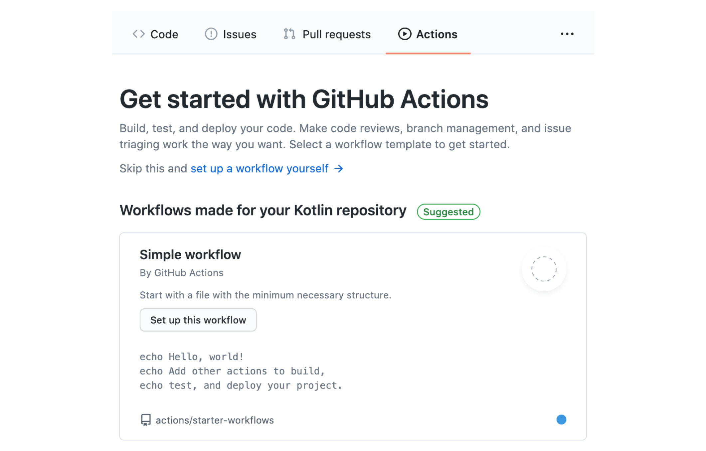
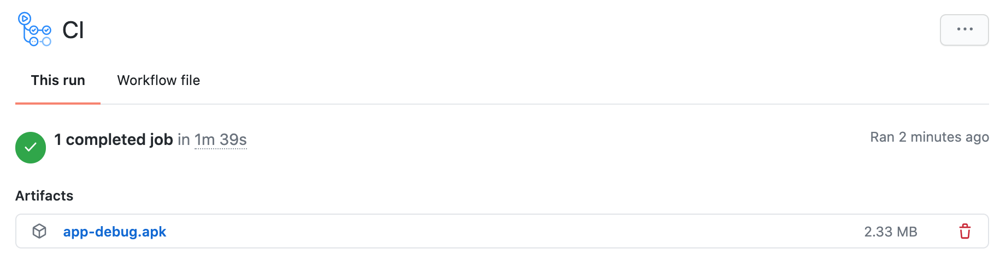

# Домашнее задание к занятию «1.1. Android Studio, SDK, эмулятор и первое приложение»

В качестве результата пришлите ссылку на ваш GitHub-проект в личном кабинете студента на сайте [netology.ru](https://netology.ru).

**Важно**: ознакомьтесь со ссылками на главной странице [репозитория с домашними заданиями](../README.md).

**Важно**: если у вас что-то не получилось, оформляйте Issue [по правилам](../report-requirements.md).

**Важно**: в рамках курса вы работаете над одним и тем же приложением. Делайте всё в одном репозитории.

## Как сдавать задачи

1. Создайте на вашем компьютере Android-проект.
1. Инициализируйте в нём пустой Git-репозиторий.
1. Добавьте в него готовый файл [.gitignore](../.gitignore).
1. Добавьте в этот же каталог остальные необходимые файлы.
1. Сделайте коммиты.
1. Создайте публичный репозиторий на GitHub и свяжите свой локальный репозиторий с удалённым.
1. Сделайте push: удостоверьтесь, что ваш код появился на GitHub.
1. Ссылку на проект отправьте в личном кабинете на сайте [netology.ru](https://netology.ru).
1. Задачи, отмеченные как необязательные, можете не сдавать: это не повлияет на получение зачета. В этом ДЗ все задачи обязательные.

## Задача Code Like a Pro

Для выполнения вам потребуется [скачать и установить Android Studio](https://github.com/netology-code/guides/blob/master/android/android_studio/instruction1.md).

### Легенда

Мы учим вас работать профессионально и современно.

На протяжении курса мы применяем современные инструменты и подходы.

Первый и ключевой — CI/CD.

Мы будем использовать [GitHub Actions](https://github.com/features/actions), собирать ваши приложения и тестировать их при каждом push.

<details>
<summary>GitHub Actions и Actions</summary>

В GitHub Actions по наступлению определённых событий запускают worker. В них вы можете производить разные операции: собирать код, запускать автотесты и т.д.

Для некоторых операций есть готовые Actions — скрипты, которые автоматизируют часть работ:

1. «Checkout» — клонирование репозитория в worker
1. Публикация файлов из worker

За клонирование отвечает [Checkout](https://github.com/marketplace/actions/checkout), за публикацию - [Upload a Build Artifact](https://github.com/marketplace/actions/upload-a-build-artifact).

Они описываются в yaml-файле в формате:
```yaml
- name: Имя шага
  uses: actions/checkout@v2 # или actions/upload-artifact@v3
  with:
    # набор опций, специфичный для конкретного Action
```
</details>

<details>
<summary>APK</summary>

APK (Android Package) - файл с расширением `.apk`, в который собирается приложение для дальнейшего распространения: Google Play или установки вручную. Получить мы его можем с помощью инструментов Android SDK.

Получив apk-файл, его можно перенести в окошко эмулятора простым Drag-and-Drop, установив для использования.

Наша цель - получить этот apk-файл. Как это сделать - читайте в разделе про Gradle Wrapper и Android Build.
</details>

<details>
<summary>Gradle Wrapper & Android Build</summary>

Мы уже знакомы с Gradle по лекциям Kotlin. Gradle - инструмент управления проектом.

В рамках Gradle определяются задачи, которые можно выполнять с кодом проекта: сборка, тестирование и т.д.

Gradle нужно устанавливать отдельно. Но для упрощения задачи есть [Gradle Wrapper](https://docs.gradle.org/current/userguide/gradle_wrapper.html) - скрипт, который поставляется вместе с вашим проектом и сам при необходимости скачивает Gradle и запускает его. Он находится в файле `gradlew` (Linux/Mac) и `gradlew.bat` (Windows).

Когда вы запускаете `gradlew build`, скрипт проверяет, скачан ли Gradle. Если нет, то скачивает, а потом сам вызывает Gradle.

Иногда файл `gradlew` нельзя запустить из-за проблем с правами. Поэтому нужна дополнительная команда, чтобы это исправить. В проектах на Koltin это выглядело так:

```yaml
- name: Grant execute permission for gradlew
  run: chmod +x gradlew
- name: Build with Gradle
  run: ./gradlew build --info
```

Мы сделаем так же. В результате успешной сборки появятся необходимые файлы: один для отладки - debug apk, второй для релиза - release apk. На этом этапе нас интересует debug-пакет. Его мы и зальём как артефакт сборки при помощи соответствующего action.

Вы можете столкнуться с ошибкой вида:
```
BUILD FAILED in 42s
License for package Android SDK Build-Tools 30.0.2 accepted.
Preparing "Install Android SDK Build-Tools 30.0.2 (revision: 30.0.2)".
Warning: Failed to read or create install properties file.
##[error]Process completed with exit code 1.
```

Это может произойти, если в вашем `build.gradle` в `buildToolsVersion` указана версия, которая ещё не доступна в конкретном worker. [Список доступных в Ubuntu 18.04](https://github.com/actions/virtual-environments/blob/main/images/linux/Ubuntu1804-README.md)). GitHub Actions не обновляет ПО день в день, поэтому при необходимости понизьте версию в своём `build.gradle` до той, которая доступна в worker.
</details>

Теперь к каждому push у вас будет `apk`, который могут установить себе другие участники команды. Для этого не нужно скачивать репозиторий, устанавливать Android SDK и собирать всё с помощью Gradle.

**Важно**: после сегодняшней лекции вы должны **для каждого проекта** настраивать GitHub Actions подобным образом. Для этого просто скопируйте каталог `.github` из уже настроенного проекта. Вручную заново все шаги делать не нужно.

### Задача

Ваша задача на первое занятие достаточно простая. По примеру из лекции создайте проект с текстовой надписью на экране `NMedia!` вместо `Hello, World`

При этом:
* applicationId: ru.netology.nmedia
* versionName: 1.0
* minSdk (минимальная версия Android): 23 (Android 6.0)

Настройте GitHub Actions и отправьте ссылку на репозиторий в личном кабинете студента.

<details>
<summary>Описание шагов выполнения</summary>

1\. Публикуете свой проект на GitHub.

2\. Переходите на вкладку Actions и выбираете любой:



3\. Заменяете содержимое на следующее (о предназначении читайте в разделе «Справка» выше):

```yaml
name: CI

on:
  push:
    branches: '*'
  pull_request:
    branches: '*'

jobs:
  build:
    runs-on: ubuntu-20.04

    steps:
      - name: Checkout Code
        uses: actions/checkout@v3

      - name: Set up JDK 17
        uses: actions/setup-java@v1
        with:
          java-version: 17

      - name: Build
        run: |
          chmod +x ./gradlew
          ./gradlew build

      - name: Upload Build Artifact
        uses: actions/upload-artifact@v3
        with:
          name: app-debug.apk
          path: app/build/outputs/apk/debug/app-debug.apk
```

4\. Убедитесь, что сборка прошла успешно и в артефактах появился `app-debug.apk`:



[Пример настроенного проекта](https://github.com/netology-code/and2ci).

</details>
