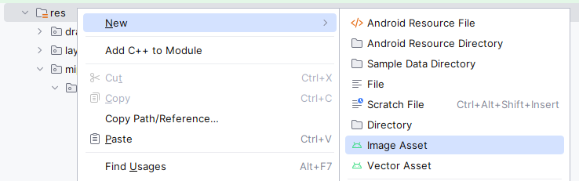

# Домашнее задание к занятию «1.2. Ресурсы, View и ViewGroup»

**Важно**: ознакомьтесь со ссылками на главной странице [репозитория с домашними заданиями](../README.md).

**Важно**: если что-то не получилось, оформите Issue согласно [правилам](../report-requirements.md).

## Как сдавать задачи

1. Откройте ваш проект с предыдущего из ДЗ.
1. Сделайте необходимые коммиты.
1. Сделайте push. Убедитесь, что ваш код появился на GitHub.
1. Ссылку на ваш проект отправьте в личном кабинете на сайте [netology.ru](https://netology.ru)
1. Задачи, отмеченные как необязательные, можете не сдавать. Это не повлияет на получение зачета (в этом ДЗ все задачи являются обязательными).

## Задача Launcher Icon

### Легенда

Сразу после "Hello, World" нужно установить своему приложению красивую кастомную иконку.

Для этого мы будем использовать [логотип Нетологии](assets/netology.svg), который уже рассматривали на лекции.

Для создания иконок используется Image Asset Studio, который входит в состав Android Studio. Asset Studio позволяет вам выбрать изображение и сам размещает необходимые файлы в каталогах `res/mipmap-<density>`.

Начиная с Android 8.0 применяется подход адаптивных иконок запуска. Они разделяют подложку иконки (background) и часть foreground (чаще всего логотип), позволяя менять форму подложки в зависимости от устройства.


Примечание: изображения с developer.android.com

### Задача

Замените иконку вашего приложения из предыдущего ДЗ на [логотип Нетологии](assets/netology.svg).

1\. Кликните правой кнопкой мыши (или Alt + Insert) на каталоге `mipmap` и выберите пункт `Image Asset`:



2\. Выберите изображение (1) и переместите ползунок Resize (2), пока логотип не будет попадать в границы — они отмечены серым цветом:


3\. Перейдите на вкладку Background Layer (1), выберите Asset Type — Color (2) и поставьте цвет — FFFFFF (3):


4\. Необязательно. Перейдите на вкладку Options. По умолчанию настройки выставлены в генерацию иконок, т. е. будут сгенерированы изображения для тех версий Android, которые не поддерживают адаптивные иконки:


5\. Подтвердите генерацию файлов, нажав Finish:


6\. Удалите старые файлы (с иконкой Android):


7\. Запустите ваше приложение в эмуляторе и убедитесь, что иконка приложения изменилась.


Если при сборке возникают ошибки, нажмите два раза Ctrl, выполните `gradlew clean` и соберите заново

<details>
<summary>Под капотом</summary>

Иконка указывается в манифесте (атрибуты android:icon и android:roundIcon)
```xml
<?xml version="1.0" encoding="utf-8"?>
<manifest xmlns:android="http://schemas.android.com/apk/res/android"
    package="ru.netology.nmedia">

    <application
        android:allowBackup="true"
        android:icon="@mipmap/ic_launcher"
        android:label="@string/app_name"
        android:roundIcon="@mipmap/ic_launcher_round"
        android:supportsRtl="true"
        android:theme="@style/AppTheme">
        <activity android:name=".MainActivity">
            <intent-filter>
                <action android:name="android.intent.action.MAIN" />

                <category android:name="android.intent.category.LAUNCHER" />
            </intent-filter>
        </activity>
    </application>

</manifest>
```

Эти значения ведут на файлы `mipmap/ic_launcher` и (`mipmap/ic_launcher_round`) соответственно. В зависимости от версии платформы это будут либо сгенерированные изображения в формате PNG или XML, в которых стоят ссылки на `foreground` и `background` ресурсы.
</details>

Опубликуйте изменения в вашем проекте на GitHub. Убедитесь, что apk собирается с помощью GitHub Actions и при установке в эмуляторе иконка приложения соответствует установленной вами.

В качестве результата пришлите ссылку на ваш GitHub-проект в личном кабинете студента на сайте [netology.ru](https://netology.ru).

## Задача Translations

### Легенда

Мы договорились, что всё делаем на двух языках: русском и английском.

Добавьте файлы переводов в своё приложение.

Переводиться должны:
1. Название приложения: пусть на русском будет «НМедиа».
1. Текст: пусть на русском будет «НМедиа!».

### Задача

1. Создайте файл переводов по аналогии с лекцией.
1. Убедитесь, что при изменении языка перевод отображается корректно.

Опубликуйте изменения в вашем проекте на GitHub. Убедитесь, что apk собирается с помощью GitHub Actions и при установке в эмуляторе приложение работает корректно.

В качестве результата пришлите ссылку на ваш GitHub-проект в личном кабинете студента на сайте [netology.ru](https://netology.ru).
