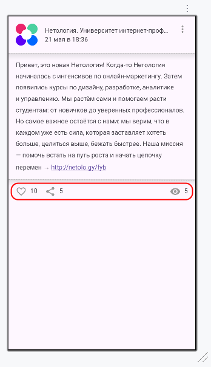

# Домашнее задание к занятию «1.3. Constraint Layout»

**Важно**: ознакомьтесь со ссылками на главной странице [репозитория с домашними заданиями](../README.md).

**Важно**: если у вас что-то не получилось, оформите Issue согласно [правилам](../report-requirements.md).

## Как сдавать задачи

1. Откройте ваш проект из предыдущего ДЗ.
1. Сделайте необходимые коммиты.
1. Сделайте push. Убедитесь, что ваш код появился на GitHub.
1. Ссылку на ваш проект отправьте в личном кабинете на сайте [netology.ru](https://netology.ru)
1. Задачи, отмеченные как необязательные, можно не сдавать. Это не повлияет на получение зачёта. В этом ДЗ все задачи обязательные.

## Задача Layout

### Легенда

Доверстайте приложение, чтобы получился следующий вид:

Обратите внимание на блок с количеством просмотров. С ним есть небольшая проблема, поскольку он расположен справа. Если количество просмотров вырастет, например, до 500, то есть два варианта:
1. Установить фиксированное расстояние от текста до границы родителя, а саму иконку приклеить к границе текста.
1. Оставить достаточное количество места, чтобы поместилось и 500, и 1К. Тогда на всех карточках положение этого блока будет одинаковым.

Проведите небольшое исследование и посмотрите, каким образом это реализовано во ВКонтакте.

Если нет доступа к Vk

Если у вас нет доступа к ВКонтакте, используйте наши скриншоты:

### Задача

Сделайте разметку в соответствии с легендой. Иконки берите из стандартного набора.

Опубликуйте изменения в вашем проекте на GitHub. Убедитесь, что apk собирается с помощью GitHub Actions.

В качестве результата пришлите ссылку на ваш GitHub-проект в личном кабинете студента на сайте [netology.ru](https://netology.ru).
