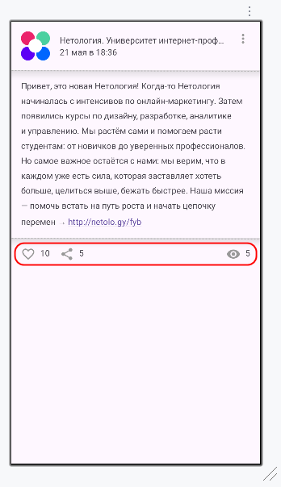

# Домашнее задание к занятию «2.1. Обработка событий в Android»

**Важно**: ознакомьтесь со ссылками, представленными на главной странице [репозитория с домашними заданиями](../README.md).

**Важно**: если у вас что-то не получилось, оформите Issue согласно [правилам](../report-requirements.md).

## Как сдавать задачи

1. Откройте ваш проект с предыдущего ДЗ.
1. Сделайте необходимые коммиты.
1. Сделайте push. Убедитесь, что ваш код появился на GitHub.
1. Ссылку на ваш проект отправьте в личном кабинете на сайте [netology.ru](https://netology.ru).
1. Задачи, отмеченные как необязательные, можно не сдавать. Это не повлияет на получение зачёта. В этом ДЗ все задачи обязательные.

## Задача Like, Share

### Легенда

Поскольку вы делаете приложение с гораздо бóльшими функциональными возможностями, чем делают лекторы, то придётся дописать часть логики (по отношению к лекции).

Ваше приложение должно выглядеть так:

### Задача

1. При клике на like должна меняться не только картинка, но и число рядом с ней: при проставлении лайка число увеличивается на 1, при снятии лайка — уменьшается на 1.
1. При клике на share должно увеличиваться число рядом: каждое нажатие увеличивает количество на 1.
1. Если количество лайков, share или просмотров перевалило за 999, должно отображаться 1K и т. д., а не 1 000. Предыдущие функции должны работать: если у поста было 999 лайков и нажали like, то должно стать 1К, если убрали лайк, то снова 999.

Правила формирования краткой записи чисел следующие:
1. Для чисел меньше 10 000 после точки отображается количество сотен. Например, 1125 отображается как 1.1К, 6399 отображается как 6.3К и т.д. 
1. После 10 000 сотни отображаться перестают - показывается просто 10К, 11К и так до 999К.
1. После 1 000 000 сотни тысяч начинают отображаться после точки - 1.3M, 10.1М и т.д.

Напишите отдельную функцию, которая будет по параметру-числу выдавать его краткую запись в виде строки. Тогда эту функцию можно будет использовать во всех местах, где требуется краткая запись.

Опубликуйте изменения в вашем проекте на GitHub. Убедитесь, что apk собирается с помощью GitHub Actions и при установке в эмуляторе приложение работает корректно.

В качестве результата пришлите ссылку на ваш GitHub-проект в личном кабинете студента на сайте [netology.ru](https://netology.ru).

## Задача Parent Child

### Легенда

Исследование поведения системы — важная часть работы разработчика.

До этого мы устанавливали `OnClickListener` только на один View.

А если мы установим разные Listener на View, которые пересекаются: на `ConstraintLayout`, который содержит все остальные View, и на кнопку `Like`?

### Задача

1. Установите обработчики `OnClickListener` на `binding.root` и `binding.like`.
1. Поставьте внутрь обработчиков точки останова.
1. Запустите приложение в режиме отладки.
1. Кликните на кнопку Like, на кнопку с тремя точками (на ней пока нет обработчика), на текст, на аватар.
1. Установите обработчик `OnClickListener` на аватар и кликните по нему снова.

В качестве результата пришлите ответы на следующие вопросы в личном кабинете студента на сайте [netology.ru](https://netology.ru):
1. Какой из обработчиков сработал при клике на кнопку Like?
1. Сработал ли обработчик на `binding.root` при клике на кнопку с тремя точками?
1. Сработал ли обработчик на `binding.root` при клике на текст?
1. Сработал ли обработчик на `binding.root` при клике на аватар до установки на avatar собственного обработчика?
1. Сработал ли обработчик на `binding.root` при клике на аватар после установки на avatar собственного обработчика?

Попробуйте выявить закономерность: когда срабатывает обработчик на контейнере, а когда нет.

Если не получается работать с отладчиком или ставить точки останова, добавьте в каждый обработчик по println с разным текстом. Если при нажатии текст будет выводиться в LogCat, то обработчик был вызван. Если текста не будет, значит обработчик вызван не был.

**Важно**: не нужно мержить эти «тесты» в master и заливать на GitHub.
