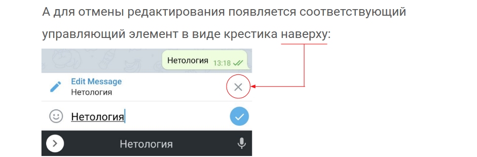

# Домашнее задание к занятию «2.4. CRUD: списки, добавление, удаление, изменение»

В качестве результата пришлите ссылку на ваш Pull Request в личном кабинете студента на сайте [netology.ru](https://netology.ru).

**Важно**: ознакомьтесь со ссылками на главной странице [репозитория с домашними заданиями](../README.md).

**Важно**: если у вас что-то не получилось оформите Issue согласно [правилам](../report-requirements.md).

## Как сдавать задачи

1. Откройте ваш проект из предыдущего ДЗ.
1. Сделайте необходимые коммиты.
1. Сделайте push. Убедитесь, что ваш код появился на GitHub.
1. Ссылку на ваш проект отправьте в личном кабинете на сайте [netology.ru](https://netology.ru).
1. Задачи, отмеченные как необязательные, можно не сдавать. Это не повлияет на получение зачёта. В этом ДЗ все задачи обязательные.

## Задача CRUD

### Задача

Добавьте реализацию CRUD в вашу версию приложения. Все функции вроде лайков с отображением количества и share должны по-прежнему работать.

Опубликуйте изменения в вашем проекте на GitHub. Убедитесь, что apk собирается с помощью GitHub Actions и при установке в эмуляторе приложение работает корректно.

В качестве результата пришлите ссылку на ваш GitHub-проект в личном кабинете студента на сайте [netology.ru](https://netology.ru).

## Задача Отмена редактирования

### Задача

Реализуйте отмену редактирования аналогично тому, как это сделано в Telegram:



Достаточно с помощью `ConstraintLayout` сформировать соответствующую структуру над полем ввода поста.

Единовременно управлять отображением/скрытием сразу нескольких `View` можно с помощью объединения их [в виртуальную группу](https://developer.android.com/reference/androidx/constraintlayout/widget/Group).

Скрыть можно с помощью:
```kotlin
group.visibility = View.GONE // перестаёт занимать место на экране
group.visibility = View.INVISIBLE // невидима, но занимает место на экране
```

Отобразить:
```kotlin
group.visibility = View.VISIBLE
```

Вам нужно выставить одно из этих значений в зависимости от данных во `ViewModel`.

Опубликуйте изменения в вашем проекте на GitHub. Убедитесь, что apk собирается с помощью GitHub Actions и при установке в эмуляторе приложение работает корректно.

В качестве результата пришлите ссылку на ваш GitHub-проект в личном кабинете студента на сайте [netology.ru](https://netology.ru).

## Задача Editing Mode

### Задача

Выберите любой пост для редактирования. Удалите его, пока он находится в форме для редактирования, при помощи меню с тремя точками. После сохранения пост должен исчезнуть.

За счет какой конструкции — проверки, функции и т. п. — пост не добавляется заново, как при обычном нажатии кнопки добавления поста? Чтобы ответить на этот вопрос, изучите код нашей реализации.

В качестве результата пришлите письменный ответ в личном кабинете студента на сайте [netology.ru](https://netology.ru).
