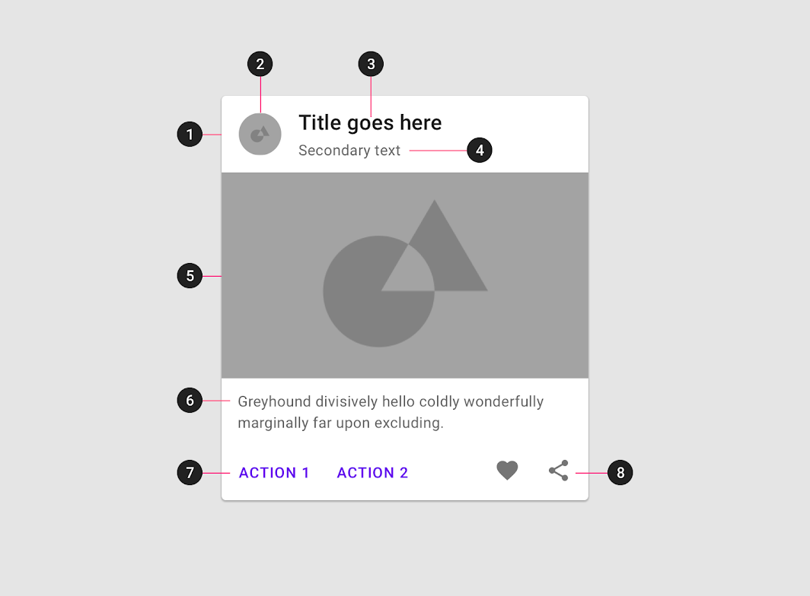

# Домашнее задание к занятию «3.1. Material Design»

В качестве результата пришлите ссылку на ваш Pull Request в личном кабинете студента на сайте [netology.ru](https://netology.ru).

**Важно**: ознакомьтесь со ссылками, представленными на главной странице [репозитория с домашними заданиями](../README.md).

**Важно**: если у вас что-то не получилось, то оформляйте Issue [по установленным правилам](../report-requirements.md).

## Как сдавать задачи

1. Откройте ваш проект с предыдущего ДЗ
1. Сделайте необходимые коммиты
1. Сделайте пуш (удостоверьтесь, что ваш код появился на GitHub)
1. Ссылку на ваш проект отправьте в личном кабинете на сайте [netology.ru](https://netology.ru)
1. Задачи, отмеченные, как необязательные, можно не сдавать, это не повлияет на получение зачета (в этом ДЗ все задачи являются обязательными)

## О документации

В мире Android всё меняется достаточно быстро. Поэтому зачастую, у нас с вами есть три актуальных источника информации:
1. [Выступления разработчиков](https://www.youtube.com/user/androiddevelopers) (если они были выпущены недавно)
1. Документация
1. Исходный код

Поэтому мы будем с вами учиться использовать все эти источники. Сегодня потренируемся в работе с документацией.

Напоминаем, что вы всегда можете прояснить непонятные моменты в чате Slack.

## Задача CardView

### Задача

Теперь, когда мы знаем про наличие готовых компонентов - нужно их только использовать.

Первый, с которого мы начнём - это [CardView](https://material.io/develop/android/components/cards).

В документации описана анатомия `CardView`:

В целом, она нам подходит.

Замените наши "самодельные" карточки на готовый компонент.

Опубликуйте изменения в вашем проекте на GitHub. Удостоверьтесь, что apk собирается с помощью GitHub Actions и при установке в эмуляторе приложение работает корректно.

В качестве результата пришлите ссылку на ваш GitHub-проект в личном кабинете студента на сайте [netology.ru](https://netology.ru).

## Задача Кнопки

### Задача

На лекции мы стилизовали Like в виде `CheckBox`'а. Вам же нужно ещё стилизовать кнопки Share и Options (и достилизовать Like).

Изучите документацию на компоненты [Buttons](https://material.io/develop/android/components/buttons), чтобы реализовать работу данных элементов (обратите внимание - это не `CheckBox`'ы).

Важные моменты: текст можно задавать сразу через атрибуты кнопки (кол-во лайков, шаринга), поэтому от `TextView` можно будет избавиться.

Создайте отдельный стиль (как мы сделали на лекции) и назначайте его кнопкам. `backgroundTint` выставлять не нужно.

В качестве результата пришлите ответ в виде текста в личном кабинете студента на сайте [netology.ru](https://netology.ru).
