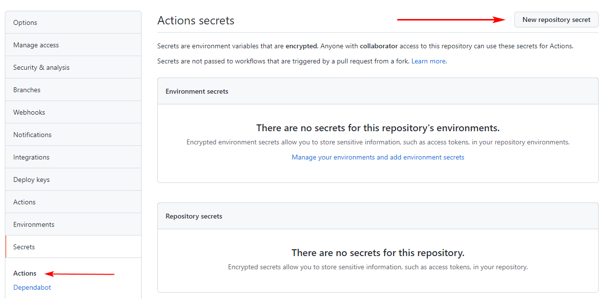
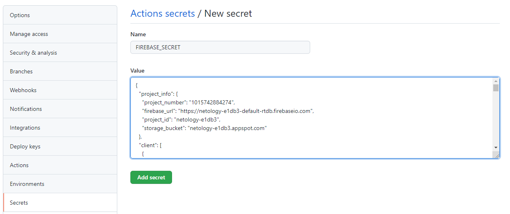

# Домашнее задание к занятию «4.3 Notifications & Pushes»

В качестве результата пришлите ссылку на ваш Pull Request в личном кабинете студента на сайте [netology.ru](https://netology.ru).

**Важно**: ознакомьтесь со ссылками, представленными на главной странице [репозитория с домашними заданиями](../README.md).

**Важно**: если у вас что-то не получилось, то оформляйте Issue [по установленным правилам](../report-requirements.md).

## Как сдавать задачи

1. Откройте ваш проект с предыдущего ДЗ
1. Сделайте необходимые коммиты
1. Сделайте пуш (удостоверьтесь, что ваш код появился на GitHub)
1. Ссылку на ваш проект отправьте в личном кабинете на сайте [netology.ru](https://netology.ru)
1. Задачи, отмеченные, как необязательные, можно не сдавать, это не повлияет на получение зачета (в этом ДЗ все задачи являются обязательными)

## Задача Exceptions

### Задача

Вам необходимо проанализировать, что произойдёт, если в приложение придёт Notification, у которого поле action не соответствует ни одному значению из Enum'а `Action`.

Предложите решение данной проблемы.

В качестве результата пришлите ссылку на ваш GitHub-проект в личном кабинете студента на сайте [netology.ru](https://netology.ru).

## Задача New Post

### Задача

Продумайте, в каком формате и какими бы данными вы реализовали уведомление о новом посте.

Для этого вам необходимо модифицировать:
1. Push-Sender
1. Ваше приложение

Кроме того, ознакомьтесь с разделом [документации](https://developer.android.com/training/notify-user/expanded#large-style), описывающей возможность "раскрытия" текста уведомления.

Реализуйте показ уведомлений о новых постах в формате:
```
<имя пользователя> опубликовал новый пост:

Текст поста... (на несколько строк)
```

В качестве результата пришлите ссылку на ваши GitHub-проекты (Android-приложение и Push-Sender) в личном кабинете студента на сайте [netology.ru](https://netology.ru).

**Важно**: ни в коем случае не закидывайте в GitHub репозиторий учётные данные (файл google-services.json). Если вы всё-таки сделали это, то воспользуйтесь соответствующей [утилитой для их удаления](https://docs.github.com/en/free-pro-team@latest/github/authenticating-to-github/removing-sensitive-data-from-a-repository).

Для того, чтобы сохранить работоспособность GitHub Actions воспользуйтесь инструкцией ниже.

<details>
<summary>Инструкция для безопасного добавления google-services.json</summary>

Вместо добавления файла в открытый доступ, можно добавить его в специальную секцию Secrets у репозитория. Она доступна только соавторам репозитория и не появится публично.

1. Откройте настройки вашего репозитория. В них перейдите в секцию Secrets (в подраздел Actions).
  
1. Нажмите на кнопку "New repository secret". В появившемся окне введите название и содержимое secret.
1. Название можно поставить любое. Для примера будем использовать имя `FIREBASE_SECRET`. В качестве содержимого вставьте полный текст вашего файла google-services.json. После этого нажмите "Add secret".
  
1. Теперь нужно дополнить yml-скрипт GitHub Actions командой для получения secret:
  
```
- name: Decode google-services.json
  env:
    FIREBASE_SECRET: ${{ secrets.FIREBASE_SECRET }}
  run: echo $FIREBASE_SECRET > ./app/google-services.json
```

Если вы использовали скрипт из наших заданий, то полный текст скрипта станет следующим:
  
```
name: CI

on:
  push:
    branches: '*'
  pull_request:
    branches: '*'

jobs:
  build:
    runs-on: ubuntu-latest

    steps:
      - name: Checkout Code
        uses: actions/checkout@v3

      - name: Set up JDK 17
        uses: actions/setup-java@v1
        with:
          java-version: 17
  
      - name: Decode google-services.json
        env:
          FIREBASE_SECRET: ${{ secrets.FIREBASE_SECRET }}
        run: echo $FIREBASE_SECRET > ./app/google-services.json

      - name: Build
        run: |
          chmod +x ./gradlew
          ./gradlew build
      - name: Upload Build Artifact
        uses: actions/upload-artifact@v3
        with:
          name: app-debug.apk
          path: app/build/outputs/apk/debug/app-debug.apk
```

После выполнения всех этих действий для каждого запуска GitHub Actions файл google-services.json будет формироваться из созданного secret, в репозитории он храниться не будет.
</details>
